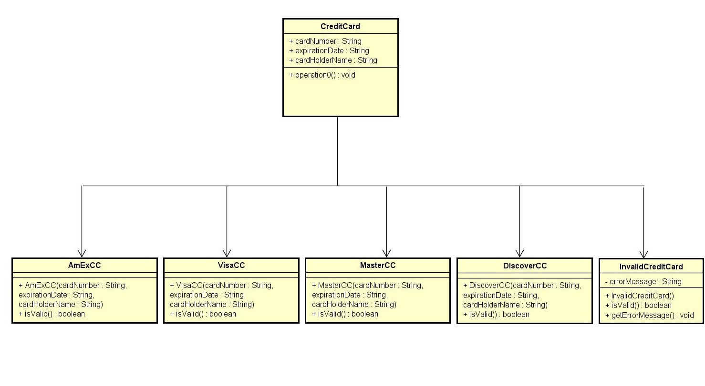
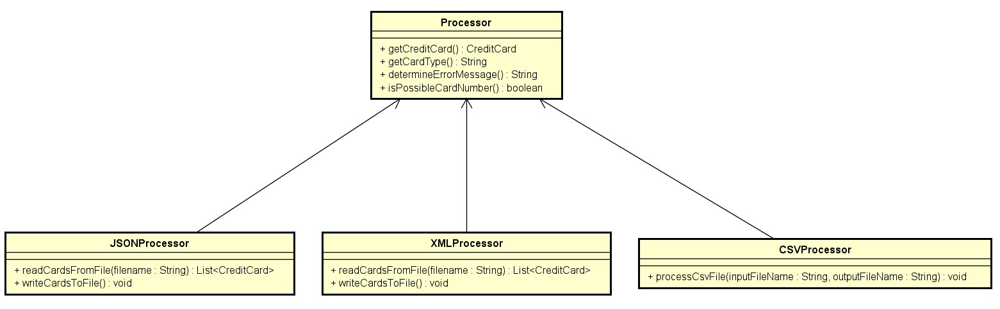
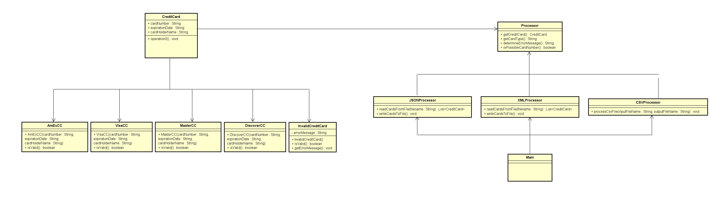

# CMPE 202 - Individual Project

**Student Name:** Matthew Wong  
**Student ID:** 014164592  
**Git Repository:** [Individual Project Repository](https://github.com/gopinathsjsu/individual-project-mcwwong)

## Primary Problem

The primary problem I am trying to solve is determining the type of card a record represents.

### Design Pattern: Strategy Pattern

The design pattern that I used here is the Strategy Pattern. The isValid() method is defined in the base class (CreditCard), and its implementation is delegated to the concrete subclasses (AmExCC, DiscoverCC, MasterCC, VisaCC). This allows each credit card type to have its own validation strategy, making it easy to extend the system by adding new card types without modifying the existing code. The InvalidCreditCard class also follows this pattern, providing an alternative strategy for handling invalid credit cards.

### Credit Card Object Class Diagram

#### Consequences of the Strategy Method

- The number of subclasses (e.g., `AmExCC`, `DiscoverCC`, `MasterCC`, `VisaCC`) may grow with the increasing number of credit card types, potentially making the system harder to manage.
- The Strategy Pattern introduces additional complexity, especially when dealing with many interchangeable algorithms or strategies.
- Switching between different strategies at runtime might introduce a slight runtime overhead.

## Secondary Problem

The secondary problem tackled in this project involves creating the proper objects to handle different types of input files (e.g., csv, xml, or json).

### Design Pattern: Factory Method Pattern

The design pattern that I used is the Factory Method Pattern. This can be seen in my Processor class. It encapsulates the logic for creating instances of CreditCard objects. The method takes in parameters such as cardNumber, expirationDate, and cardHolderName and decides which concrete subclass of CreditCard to instantiate based on certain conditions. The method contains conditional statements that check the cardNumber against certain patterns to determine the type of credit card. Depending on the conditions, it instantiates and returns an object of the corresponding subclass (VisaCC, MasterCC, etc.) or returns null if the card number doesn't match any known patterns. The client code uses the factory method (getCreditCard) to obtain an instance of CreditCard. The actual class of the returned object depends on the conditions specified in the factory method.

### Processor Class Diagram

#### Consequences of the Factory Method

- Increased complexity may occur as more credit card types are introduced or additional conditions are added to the factory method.
- Direct creation of instances of concrete classes (`VisaCC`, `MasterCC`, etc.) leads to tight coupling between the `Processor` class and these concrete implementations.
- The open-closed principle might be violated if changes are required to the existing factory method logic to accommodate new types.

### Overall Class Diagram

---
